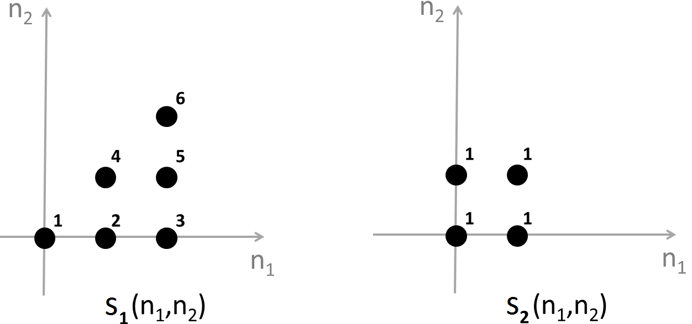

## Week 2

### Question 1

After applying spatial filtering to an image, you find that the output image looks more blurry than the original image, i.e., some details like sharp edges are lost. Based on this description, the filter applied is most likely to be which of the following types?

- [ ] A high-pass filter
- [x] A low-pass filter
- [ ] A band-pass filter
- [ ] A band-stop filter

### Question 2

Which one of the following impulse responses acts a high-pass filter?

- [ ] 
- [ ] 
- [x] 
- [ ] 

### Question 3

What is the linear convolution of s1(n1,n2) and s2(n1,n2)?



- [ ] 
- [x] 
- [ ] 
- [ ] None of the above.

### Question 4

A linear shift-invariant system is fully characterizable by its impulse response.

- [x] True
- [ ] False

### Question 5

Check all the statements that apply to any linear shift-invariant system T:


- [x] If the output to x(n1,n2)=δ(n1,n2) is known, it is possible to find the output to any other input.
- [x] The output to x(n1,n2)=ej(ω1n1+ω2n2) is always proportional to the input, i.e., y(n1,n2)=Cx(n1,n2) where C is a complex constant.
- [ ] It is possible that the zero input (i.e., x(n1,n2)=0) results in a non-zero output (i.e., y(n1,n2)≠0).
- [ ] If y(n1,n2)=0 then x(n1,n2)=0.

### Question 6

The regions of support of two images x(n1,n2) and y(n1,n2) are given respectively by Sx={(n1,n2)|0≤n1≤P1−1,0≤n2≤P2−1)} and Sy={(n1,n2)|0≤n1≤Q1−1,0≤n2≤Q2−1)}. Which of the following statements is true regarding the linear convolution of x(n1,n2) and y(n1,n2), i.e., z(n1,n2)=x(n1,n2)⋆⋆y(n1,n2).

- [ ] z(n1,n2) is always non-zero over Sz={(n1,n2)|0≤n1≤P1+Q1−1,0≤n2≤P2+Q2−1)}.
- [ ] z(n1,n2) is always non-zero over Sz={(n1,n2)|0≤n1≤P1+Q1−2,0≤n2≤P2+Q2−2)}.
- [ ] z(n1,n2) is always zero outside Sz={(n1,n2)|0≤n1≤P1+Q1−1,0≤n2≤P2+Q2−1)}.
- [x] z(n1,n2) is always zero outside Sz={(n1,n2)|0≤n1≤P1+Q1−2,0≤n2≤P2+Q2−2)}.

### Question 7

In this problem and the next, you will implement spatial-domain low-pass filtering using MATLAB, and evaluate the difference between the filtered image and the original image using two quantitative metrics called Mean Squared Error (MSE) and Peak Signal-to-Noise Ratio (PSNR). Given two N1×N2 images x(n1,n2) and y(n1,n2), the MSE is computed as MSE=1N1N2∑N1n1=1∑N2n2=1[x(n1,n2)−y(n1,n2)]2.

The PSNR is defined as PSNR=10log10(MAX2IMSE), where MAXI is the maximum possible pixel value of the images. For the 8-bit gray-scale images considered in this problem, MAXI=255.

Follow the instructions below to finish this problem.

1. Download the original image from [here](q7_img1.gif). The original image is a 256×256 8-bit gray-scale image.

2. Convert the original image from type 'uint8' (8-bit integer) to 'double' (real number).

3. Create a 3×3 low-pass filter with all coefficients equal to 1/9, i.e., create a 3×3 MATLAB array with all elements equal to 1/9.

4. Low-pass filter the original image (converted to type 'double') with the filter created in step (3). This can be done using the built-in MATLAB function "imfilter". The function "imfilter" takes three arguments and returns one output. The first argument is the original image (converted to type 'double'); the second argument is the low-pass filter created in step (3); and the third argument is a string specifying the boundary filtering option. For this problem, use 'replicate' (including the single quotes) for the third argument. The output of the function "imfilter" is the filtered image.

5. Compute the PSNR value between the original image (converted to type 'double') and the filtered image by using the formulae given above.

Enter the PSNR value (up to two decimal points):

``` matlab
img_original = imread('lena.gif');
img_cast = im2double(img_original);
lpf_3x3 = repmat(1/9, 3);
img_result = imfilter(img_cast, lpf_3x3, 'replicate');
psnr(img_result, img_cast);
ans

ans = 
    
    29.29
```

### Question 8

Repeat steps (3) through (5) in the previous question, this time using a 5×5 low-pass filter with all coefficients equal to 1/25. Enter the PSNR value (up to two decimal points):

``` matlab
lpf_5x5 = repmat(1/25, 5);
img_result2 = imfilter(img_cast, lpf_5x5, 'replicate');
psnr(img_result2, img_cast);
ans

ans = 

    25.73
```
