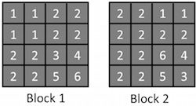
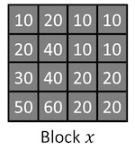
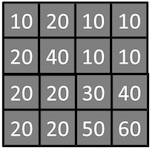
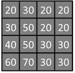
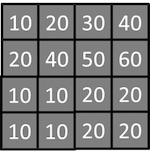
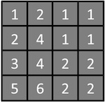

## Week 3

### Question 1

Check all the applications where motion estimation can be employed to improve the results:

- [x] Object tracking
- [x] Human-computer interaction
- [ ] Still image inpainting
- [x] Video compression
- [ ] Segmentation of a single image

### Question 2

We want to increase the frame rate of a video sequence by inserting a new frame between every two existing consecutive frames. Denote by y the new frame formed via linear interpolation of motion vectors between frames xt−1 and xt in the original video. Assuming that a circular object is centered at pixel (i,j) in xt−1 and at pixel (p,q) in xt, where will it be centered in y?

- [ ] (p+i,q+j)
- [x] ((p+i)/2,(q+j)/2)
- [ ] (p−i,q−j)
- [ ] ((p−i)/2,(q−j)/2)

### Question 3

Calculate the Mean Square Error (MSE) between the two given image blocks (enter your answer to at least one decimal point):



#### Solution

``` matlab
b1 = [2,2,5,6; 2,2,3,4; 1,1,2,2; 1,1,2,2];
b2 = [2,2,5,3; 2,2,6,4; 2,2,2,2; 2,2,1,1];
immse(b1, b2)

ans =

    1.5000
```

### Question 4

Assume that we want to perform block matching for the image block x given below. Which of the following image blocks is a better match in the Mean Absolute Error (MAE) sense?



- [ ] 
- [x] 
- [ ] 
- [ ] 

#### Solution

``` matlab
b1 = [50,60,20,20; 30,40,20,20; 20,40,10,10; 10,20,10,10];
b21 = [20,20,50,60; 20,20,30,40; 20,40,10,10; 10,20,10,10];
b22 = [60,70,30,30; 40,50,30,30; 30,50,20,20; 20,30,20,20];
b23 = [10,10,20,20; 10,10,20,20; 20,40,50,60; 10,20,30,40];
b24 = [5,6,2,2; 3,4,2,2; 2,4,1,1; 1,2,1,1];
mae(b1, b21)

ans =

   12.5000

mae(b1, b22)

ans =

    10 % <--- Answer

mae(b1, b23)

ans =

   17.5000

mae(b1, b24)

ans =

   21.9375

```

### Question 5

(True or False) Sub-pixel motion estimation is used in applications where a faster and hence less accurate estimation of motion is needed.

- [ ] True
- [X] False

### Question 6

Refer to the RGB cube shown in the video lecture for this problem. Color magenta can be obtained by 1:1 mixing red and blue; yellow can be obtained by 1:1 mixing red and green; cyan can be obtained by 1:1 mixing blue and green. If magenta, yellow, and cyan are mixed at 1:1:1 proportion, what is the resulting color?

- [ ] red
- [ ] green
- [ ] blue
- [X] white
- [ ] black

### Question 7

(True or False) Intensity in HSI color space is exactly the same as the Y-channel in YCbCr color space, as both represent the "brightness" of an image.

- [ ] True
- [X] False

### Question 8

In the next two problems you will perform block matching motion estimation between two consecutive video frames. Follow the instructions below to complete this problem.

1. Download the two video frames from [frame_1](frame_1.jpg) and [frame_2](frame_2.jpg). The frames/images are of height 288 and width 352.

2. Load the frame with file name "frame_1.jpg" into a 288×352 MATLAB array using function "imread", and then convert the array type from 8-bit integer to real number using function "double" or "cast" (note that the range of intensity values after conversion is between 0 and 255). Denote by I1 the converted MATLAB array. Repeat this step for the frame with file name "frame_2.jpg" and denote the resulting MATLAB array by I2. In this problem, I2 corresponds to the current frame, and I1 corresponds to the previous frame (i.e., the reference frame).

3. Consider the 32×32 target block in I2 that has its upper-left corner at (65,81) and lower-right corner at (96,112). Note this is MATLAB coordinate convention, i.e., the first number between the parenthesis is the row index extending from 1 to 288 and the second number is the column index extending from 1 to 352. This target block is therefore a 32×32 sub-array of I2.

4. Denote the target block by Btarget. Motion estimation via block matching searches for the 32×32 sub-array of I1 that is "most similar" to Btarget. Recall in the video lectures we have introduced various forms of matching criteria, e.g., correlation coefficient, mean-squared-error (MSE), mean-absolute-error (MAE), etc.

In this problem, we use MAE as the matching criterion. Given two blocks B1 and B2 both of size M×N, the MAE is defined as MAE(B1,B2)=1M×N∑Mi=1∑Nj=1|B1(i,j)−B2(i,j)|. To find the block in I1 that is most similar to Btarget in the MAE sense, you will need to scan through all the 32×32 blocks in I1, compute the MAE between each of these blocks and Btarget, and find the one that yields the smallest value of MAE.

Note in practice motion search is only performed over a certain region of the reference frame, but for the sake of simplicity, we perform motion search over the entire reference frame I1 in this problem and the next. When you find the matched block in I1, enter the sum of the x and y coordinates of the upper-left corner of the matched block in MATLAB convention. For example, if the matched block has the upper-left corner located at (10,20) then you must enter 30.

#### Solution

``` matlab
frame1 = imread('frame_1.jpg');
frame2 = imread('frame_2.jpg');
frame1_cast = im2double(frame1);
frame2_cast = im2double(frame2);
block = frame2_cast(65:96,81:112);
mae_min = 1000.0;
for i = 1:256;
  for j = 1:320;
    res = mae(block, frame1_cast(i:i+31, j:j+31));
    if mae_min > res;
      mae_min = res;
      ans = [i, j];
    end;
  end;
end;

ans =

   65.0000   81.0000 % <-- Answer 146

```

### Question 9

In the previous question, what was the corresponding MAE value (up to two decimal points)?

#### Solution

``` matlab
mae_min =

   22.985

```
