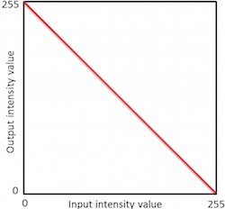
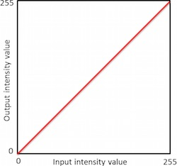
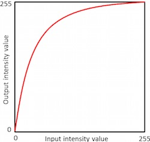
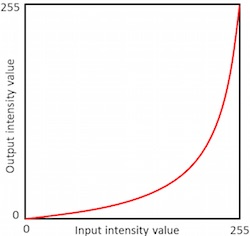
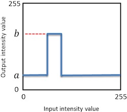

## Week 5

### Question 1

The main difference between image enhancement and image restoration is the fact that the degradation model must be known in latter.

- [x] True
- [ ] False

### Question 2

If you wanted to make an image look brighter than what it currently does, which one of the following intensity transformations would you use?

- [ ] 
- [ ] 
- [x] 
- [ ] 

### Question 3

The mean and standard deviation of pixel intensity values in an 8-bit gray-scale image are 120 and 10, respectively. What are the mean and standard deviation of pixel intensity values in the negative of this image?

- [x] 135, 10
- [ ] 120, 10
- [ ] 110, 20
- [ ] They can't be determined without knowing the size of the image.

### Question 4

Check all statements that apply to the following intensity transformation:



- [x] The output image is binary since its pixels take on only two intensity levels.
- [ ] It is possible to recover the input image after it undergoes this transformation.
- [x] The mean intensity value of the pixels in the transformed image is always between a and b (including the end points a and b).
- [ ] In the transformed image, the number of pixels with intensity level b is less than the number of pixels with intensity level a.

### Question 5

Check all statements that are true regarding image histogram equalization:

- [x] After histogram equalization, the intensity values are more effectively distributed over the histogram range.
- [ ] The mean intensity value of the pixels in an image increases after histogram equalization.
- [ ] After histogram equalization images will always look brighter.
- [x] If pixel p is the brightest pixel in image x, it will remain the brightest pixel after histogram equalization.

### Question 6

Check all that apply:

- [ ] Median filters are linear.
- [ ] Median filters are well-suited to deal with additive Gaussian noise.
- [ ] The performance of median filters is independent of the number of noisy pixels.
- [x] If you apply a median filter on a noisy image for a large number of times, the image will stop changing after some point.

### Question 7

In this problem and the next two, you will perform median filtering to enhance the quality of a noise corrupted image. Recall from the video lecture that median filtering is effective for removing "salt-and-pepper" noise from images. Follow the instructions below to complete this problem.

1. Download the noisy image from [here](q7_img1.jpg). Load the noisy image into a MATLAB array and convert the type of the array from 8-bit integer 'uint8' to real number 'double'. Refer to MATLAB problems in previous homework if you need help with loading and converting images. Visualize the noisy image using the built-in MATLAB function "imshow". The function "imshow" takes as its argument either [0-255] for an 8-bit integer array (i.e., of type 'uint8'), or [0-1] for a normalized real-valued array (i.e., of type 'double'). To provide "imshow" with the correct argument, you would need either to "cast" your real-valued array into 'uint8', or normalize it by 255.

2. Perform 3x3 median filtering using the built-in MATLAB function "medfilt2". For this problem, the only argument you need to provide "medfilt2" with is the array you have created in step (1). Visualize the filtered image using "imshow". Remember to either cast the result to 'uint8' or normalize it before feeding it to "imshow".

3. Perform a second-pass median filtering on the filtered image that you have obtained from step (2). Visualize the two-pass filtered image. Compare it with the noisy input image and the 1-pass filtered image.

4. Download the noise-free image from [here](q7_img2.jpg). Compute the PSNR value between the noise-free image and the noisy input image in the box below (up to two decimal points).

#### Solution

```matlab
img_n = imread('q7_img1.jpg');
img_o = imread('q7_img2.jpg');
img_n = im2double(img_n);
img_o = im2double(img_o);
psnr(img_n, img_o)

ans =

   11.3323
```

### Question 8

Enter the PSNR value between the noise-free image and the 1-pass filtering output in the box below (up to two decimal points).

#### Solution

```matlab
img_r = medfilt2(img_n);
psnr(img_r, img_o)

ans =

   27.3766
```

### Question 9

Enter the PSNR value between the noise-free image and the 2-pass filtering output in the box below (up to two decimal points).

#### Solution

```matlab
img_r = medfilt2(img_r);
psnr(img_r, img_o)

ans =

   29.6499
```
