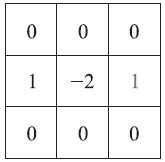

# Week 11

### Question 1

A binary image contains straight lines oriented vertically. Assume that the intensities of the lines and background are 1 and 0, respectively.

Which of the masks below can be used to detect 1-pixel gaps in these lines?

- [ ] 
- [x] 
- [ ] 
- [ ] 

### Question 2

An edge profile is shown on the right. Which of the sketches below shows the Laplacian of the edge profile?


- [ ] 
- [x] 
- [ ] 
- [ ] 

### Question 3

The average value of the Laplacian of a Gaussian operator ∇2G(x,y) is zero.

- [x] True
- [ ] False

### Question 4

The average value of any image convolved with the Laplacian of a Gaussian operator is zero.

- [x] True
- [ ] False

### Question 5

G and f are discrete arrays of size n∗n and M∗N, respectively. The Gaussian function is given by G(x,y)=e−x2+y22σ2. It is a fact that the 2-D convolution of the Gaussian function G(x,y) with an image f(x,y) can be expressed as the 1-D convolution along the rows (columns) of f(x,y) followed by the 1-D convolution along the columns (rows) of the result. What is the computational advantage of using the 1-D convolution approach described above as opposed to 2-D convolution directly? The computational advantage is the ratio of the number of multiplications required by the 2-D convolution approach over the number required by the 1-D convolution approach.

- [ ] n
- [ ] n^n
- [x] n/2
- [ ] sqrt(n)

### Question 6

Refer to the Hough transform. A line given by y=ax+b in its slope-intercept form can be transformed into the (ρ,θ) space. What is ρ and θ in the case of a=−2,b=1 ?

- [ ] θ=−26.6o,ρ=−0.45
- [x] θ=26.6o,ρ=0.45
- [ ] θ=−30o,ρ=−0.5
- [ ] θ=30o,ρ=0.5

### Question 7 

Suppose that the intensities of an image f(x,y) are in the range [0,1] and that a threshold T successfully segments the image into objects and background.

The negative of an image with intensity levels in the range [0,1] is obtained by using the negative transformation given by the expression

s=1–r

where r stands for the original intensity levels of the image.

Which of the following statements are correct? Check all that apply.

- [x] T′=1–T will successfully segment the negative of f(x,y) into the same regions
- [ ] T′=−T will successfully segment the negative of f(x,y) into the same regions
- [x] Any transformation function that preserves the order of intensities will preserve the separabiliy established by the threshold, with the new threshold being the old threshold processed with the transformation function.
- [ ] A transformation function that preserves the order of intensities may not preserve the separabiliy established by the threshold, with the new threshold being the old threshold processed with the transformation function.

### Question 8

Assuming that the intensity levels in the object exceed the value of the background and that the threshold is not set larger than all the differences encountered as the object moves, which of the following statements are correct? Check all that apply.

- [ ] The nonzero entries in the positive ADI continues to grow in dimension, provided that the object is moving.
- [x] The nonzero entries in the positive ADI always occupy the same area, regardless of the motion undergone by the object.
- [x] The nonzero entries in the negative ADI continue to grow in dimension provided that the object is moving.

### Question 9

In this problem, you will use Accumulative Difference Image (ADI) to calculate the motion of an object. The object is a bright rectangle moving with a constant speed in a dark background.

Your task is to find out the speed of the object in the horizontal direction (x direction) and in the vertical direction (y direction), as well as the total space this object occupied while moving. The total space is defined as the total number of pixels that this object occupies at least once during its movement.

Download the MATLAB code "motion_ADI.m" from here. The code has detailed comments regarding each functioning part. Basically, the code generates the reference frame and 10 consecutive frames containing the moving object.

All you need to do is to decide on the appropriate threshold T in line 23 in the code and implement the three equations for ADI in the video lectures regarding motion-based segmentation. Starting your code flowing line 37 and finish it before the end of the for-loop. The rest of the code will calculate the speed of the moving object and the total space it occupies for you. Enter the sum of the values for speed_X_Direction and speed_Y_Direction in the box below.

#### Solution

```matlab
ans =
    
    17 % <- Answer
```

### Question 10

In the previous question, what was the value of total_space_occupied?

#### Solution

```matlab
ans =
    
    12691 % <- Answer
```
